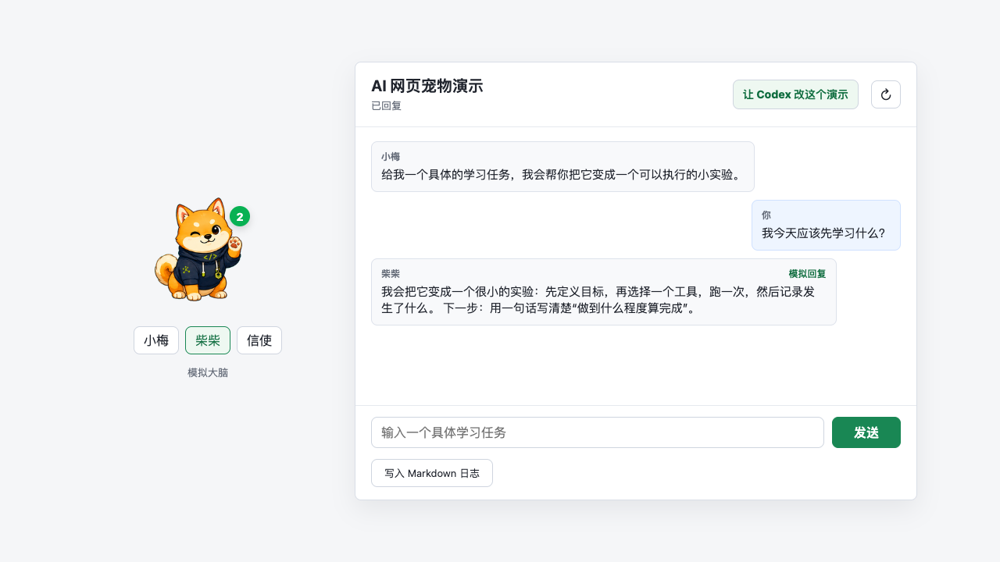

# Unit 4

## 用 Codex 改造一个真实网页宠物



---

# 这次不是从零写网站

课程已经准备好：

- 一个会动的网页宠物；
- 三套可以切换的外观；
- 聊天气泡和模拟回复；
- DeepSeek 接口；
- 组件地图、修改说明和检查方法。

我们的任务是理解、选择、修改和验证。

---

# 三个位置承担不同工作

| 位置 | 放什么 |
| --- | --- |
| 学习 Workspace | 课程入口、提示词和模板 |
| `ai-pet-demo` | 网页代码、测试、本地配置和 Git 历史 |
| 个人 Obsidian | 协作计划、设计判断、验证报告和学习日志 |

代码和知识记录可以在不同文件夹，但 Codex 能同时读取它们。

---

# Vibe Coding 不是让 AI 随便写

```text
人提出一个看得见的小目标
→ Codex 解释相关组件
→ 人确认范围
→ Codex 修改并运行检查
→ 人打开网页判断结果
→ 不符合就继续修正
```

人负责方向和验收，Codex 负责读取、修改和验证。

---

# 先确认原来的 Demo 是好的

在任何修改之前，先看见三个事实：

1. 宠物真的在动；
2. 至少两套 skin 能切换；
3. 发送消息后出现带“模拟回复”标记的气泡。

没有基线，就无法判断后面的变化是不是自己造成的。

---

# 两个方向可以并行

| 视觉方向 | API 方向 |
| --- | --- |
| 名字、欢迎语、skin、气泡、颜色 | DeepSeek 配置、消息链路、错误提示、验证 |
| 用眼睛判断设计是否符合意图 | 用状态、模型名和真实回复判断是否接通 |

选择不同文件和不同目标，最后再组合检查。

---

# 页面背后只有三层

```text
网页界面
public/
        ↓
本地服务
src/server.mjs
        ↓
回复大脑
src/brain/mock-brain.mjs
src/brain/deepseek-brain.mjs
```

组件地图的作用，是让 Codex 先找到相关部分，不从头扫描整个项目。

---

# API 是一次可以看见的往返

```text
网页输入一句话
→ 本地服务发送请求
→ DeepSeek 返回文字
→ 页面把文字显示成气泡
```

页面必须显示 `DeepSeek` 和模型名。只有 mock 回复，不能算真实 API 接通。

来源：[DeepSeek API Docs](https://api-docs.deepseek.com/)

---

# 合作成果进入课堂 branch

```text
个人 Fork A ── Pull Request ──┐
                              ├──> class/2026-07
个人 Fork B ── Pull Request ──┘

main 始终保留干净脚手架
```

先合并一个小改动，重新检查，再合并第二个。

---

# 有情感，不等于假装成人

网页宠物可以：

- 用亲近的方式说话；
- 用状态表达“思考中”或“等待确认”；
- 在不确定时请人检查。

网页宠物不能：

- 假装拥有不存在的记忆；
- 把建议说成事实；
- 用可爱的语气掩盖失败。

---

# 完成必须有四类证据

| 证据 | 要看到什么 |
| --- | --- |
| 页面 | 一个明确的小改动真的出现 |
| API | 一次 DeepSeek 真实文本回复 |
| 工程 | `npm run check` 通过，mock 仍可用 |
| 协作 | branch、commit、PR、review 和组合检查 |

Codex 的“已经完成”不是证据，人亲自看到的结果才是。

---

# 下一步：把命题作文变成自己的项目

Unit 4 给了一份清楚的脚手架：

```text
目标已经缩小
组件已经准备
结果可以验证
```

下一个 Unit 会拿自己的模糊想法，先问清楚，再建立同样可执行、可检查的项目路径。
